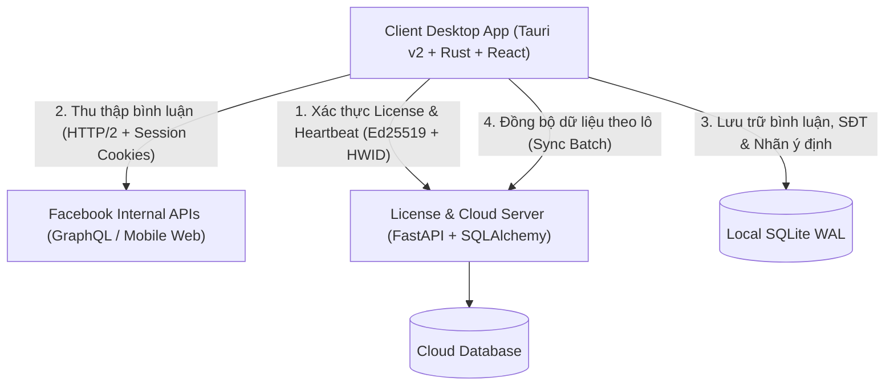

# C9 Social Assistant - Bóc tách bài viết & Bình luận Facebook

Hệ thống ứng dụng thương mại chuyên dụng trích xuất, theo dõi và bóc tách dữ liệu bài viết & bình luận Facebook phục vụ kinh doanh online, livestream bán hàng, tự động phát hiện số điện thoại khách hàng và phân loại ý định đặt hàng.

---

## 🌟 Tính Năng Nổi Bật

- 🚀 **Cào dữ liệu tốc độ cao (In-App Facebook GraphQL & HTML Fallback)**:
  - Gọi trực tiếp `doc_id` GraphQL nội bộ của Facebook qua HTTP/2 với session cookies.
  - Tích hợp cơ chế Jitter Delay ngẫu nhiên (1.8s - 3.8s) giữa các lần phân trang giúp hạn chế tối đa checkpoint tài khoản.
  - Quét gia tăng (*Incremental Crawling*): Tự động nhận diện mốc thời gian và cursor cũ, dừng ngay khi chạm dữ liệu đã quét trước đó.
- 🔐 **Đăng nhập Facebook tích hợp Webview (Hỗ trợ 2FA)**:
  - Mở cửa sổ Webview native để người dùng đăng nhập Facebook an toàn, hỗ trợ vượt mã bảo mật 2FA/OTP.
  - Tự động bóc tách bộ cookies bảo mật (`c_user`, `xs`, `datr`, `fr`) và token `fb_dtsg` vào SQLite, không cần copy thủ công phức tạp.
- 🎯 **Nhận diện Số Điện Thoại & Phân loại Ý định (Rule-based & AI-ready)**:
  - Bóc tách chuẩn số điện thoại di động Việt Nam (các đầu số 03x, 05x, 07x, 08x, 09x kể cả định dạng có dấu chấm, khoảng trắng, gạch ngang).
  - Tự động gắn nhãn ý định:
    - 🟢 `[Chốt đơn]`: Khách để lại SĐT, số lượng, địa chỉ, chọn size, màu.
    - 🔵 `[Hỏi giá]`: Khách hỏi giá, tư vấn sản phẩm, inbox.
    - 🔴 `[Khiếu nại]`: Phản ánh chất lượng, giao thiếu hàng, khiếu nại dịch vụ.
    - ⚪ `[Spam]`: Bình luận rác, link quảng cáo, tuyển dụng chéo.
- ⏱ **Theo dõi Bài viết & Quét tự động (Background Watchlist Tracker)**:
  - Cho phép cấu hình chu kỳ tự động quét (VD: mỗi 5 phút, 15 phút, 30 phút).
  - Background worker chạy ngầm độc lập trong Rust native, phát thông báo tiến trình real-time lên giao diện UI.
  - Nút "Quét ngay" (*Scan Now*) để cập nhật tức thì bài viết đang livestream hoặc chạy quảng cáo.
- 🛡 **Bảo mật Bản quyền Trực tuyến (Strict Online-Only Ed25519 & HWID)**:
  - Sử dụng mật mã bất đối xứng **Ed25519** (`cryptography`): Server nắm Private Key ký session token, Client verify qua Public Key.
  - Định danh thiết bị qua vân tay phần cứng **HWID** (CPU ID, Serial bo mạch chủ, Disk UUID băm SHA-256).
  - Chống dịch ngược với Rust release profile tối ưu (`opt-level = "z"`, `strip = true`, `lto = true`) và che giấu chuỗi nhạy cảm bằng `obfstring`.
  - Heartbeat kiểm tra định kỳ 5 phút/lần; tự động khóa giao diện an toàn nếu phát hiện vi phạm bản quyền hoặc ngắt kết nối.
- 💾 **Lưu trữ Cục bộ SQLite WAL Mode & Cloud Sync**:
  - Tối ưu ghi dữ liệu siêu tốc bằng SQLite WAL Mode (`PRAGMA journal_mode = WAL; PRAGMA synchronous = NORMAL;`).
  - Ghi theo batch transaction (500 items/commit) giữ UI luôn mượt mà.
  - Hỗ trợ 1-click đồng bộ toàn bộ dữ liệu bài viết & bình luận lên Cloud Backend.
- 📊 **Xuất Dữ liệu Excel & CSV**:
  - Xuất danh sách bình luận đã lọc SĐT và ý định ra định dạng CSV/Excel chỉ với một cú nhấp chuột phục vụ đội ngũ telesale.

---

## 🏗 Kiến trúc Hệ thống



---

## 🛠 Yêu cầu Môi trường

- **Hệ điều hành**: macOS, Windows 10/11, hoặc Linux.
- **Node.js**: Phiên bản 24+ (khuyến nghị dùng `nvm use 24`).
- **Python**: Phiên bản 3.12+.
- **Rust & Cargo**: Phiên bản 1.77+ (để build Tauri Desktop App).

---

## 🚀 Hướng Dẫn Chạy Nhanh

### Cách 1: Sử dụng Script Khởi Động Tự Động (Khuyên Dùng)

Dự án đã tích hợp sẵn script [run-dev.sh](file:///Users/nguyenquyen/Dev/c9_social_assistant/run-dev.sh) tự động dọn dẹp port, kích hoạt môi trường ảo Python, sinh khóa bản quyền và khởi động toàn bộ hệ thống:

```bash
# Cấp quyền thực thi (nếu cần)
chmod +x run-dev.sh

# Chạy đầy đủ cả Backend Server và Desktop App (Tauri Native)
./run-dev.sh

# Hoặc chạy ở chế độ Web Browser (không cần mở cửa sổ Desktop)
./run-dev.sh --web
```

---

### Cách 2: Khởi Chạy Thủ Công Từng Thành Phần

#### Bước 1: Khởi động Backend Server
```bash
cd backend

# Tạo và kích hoạt môi trường ảo Python
python3 -m venv .venv
source .venv/bin/activate  # Trên Windows: .venv\Scripts\activate

# Cài đặt thư viện phụ thuộc
pip install -r requirements.txt

# Khởi tạo cặp khóa Ed25519 và license mẫu (C9-PRO-2026-VIP)
python seed.py

# Khởi chạy server FastAPI
python -m uvicorn server.main:app --host 0.0.0.0 --port 8000 --reload
```

#### Bước 2: Khởi động Client App (Tauri Desktop / Vite Web)
```bash
# Mở một terminal mới
cd pc_client_app

# Sử dụng Node 24
nvm use 24

# Cài đặt dependencies
npm install

# Lựa chọn 1: Khởi chạy giao diện Web trên trình duyệt (http://localhost:1420)
npm run dev

# Lựa chọn 2: Khởi chạy ứng dụng Desktop Tauri hoàn chỉnh
npm run tauri dev
```

---

## 📦 Hướng Dẫn Build Client (Đóng gói Cài đặt Desktop)

Ứng dụng hỗ trợ đóng gói nhị phân độc lập (file `.app`, `.dmg` trên macOS; `.msi`, `.exe` trên Windows; `.deb`, `.AppImage` trên Linux) với profile chống dịch ngược (Anti-reversing, LTO, Strip debug info).

### Cách 1: Sử dụng Script 1-Click (Khuyên dùng)
```bash
# Cấp quyền thực thi (nếu cần)
chmod +x build-client.sh

# Build bản phát hành chính thức (Release Bundle)
./build-client.sh

# Hoặc build nhanh để kiểm thử (Debug Bundle)
./build-client.sh --debug
```

### Cách 2: Sử dụng lệnh npm trực tiếp trong thư mục `pc_client_app`
```bash
cd pc_client_app
nvm use 24

# Build bản Release
npm run build:app

# Hoặc build bản Debug
npm run build:debug
```

File cài đặt đầu ra sẽ nằm tại:
`pc_client_app/src-tauri/target/release/bundle/`

---

## 📖 Hướng Dẫn Sử Dụng Chi Tiết

### 1. Kích hoạt Bản quyền Ứng dụng
1. Khi mở app lần đầu, màn hình yêu cầu bản quyền sẽ xuất hiện.
2. Nhập thông tin:
   - **License Key**: `C9-PRO-2026-VIP` *(Key dùng thử 1 năm được tạo sẵn bởi `seed.py`)*.
   - **Server URL**: `http://127.0.0.1:8000`.
3. Bấm **"Kích hoạt Bản quyền"**. Client sẽ giao tiếp với Server, gửi HWID và xác minh chữ ký số Ed25519.

### 2. Cài đặt Phiên Đăng nhập Facebook
1. Trên thanh công cụ, nhấn nút **"Cấu hình Facebook"** (biểu tượng chìa khóa / cookie).
2. Chọn **"Mở Trình Duyệt Đăng Nhập Facebook"**:
   - Cửa sổ đăng nhập Facebook hiện ra. Đăng nhập tài khoản và vượt qua mã 2FA.
   - Bấm **"Trích Xuất Tự Động Từ Trình Duyệt"**. Hệ thống sẽ tự động đọc `c_user`, `xs`, `datr`, `fr`, `fb_dtsg` và lưu an toàn vào SQLite cục bộ.
3. Ngoài ra, bạn cũng có thể dán thủ công chuỗi cookie nếu muốn.

### 3. Thêm Bài viết Cần Quét & Theo dõi
1. Bấm **"Thêm Bài Viết"** trên Dashboard.
2. Dán link bài viết Facebook (hoặc Post ID) và cấu hình **Chu kỳ tự động quét** (mặc định 15 hoặc 30 phút).
3. Ứng dụng sẽ tự động phân tích URL, lấy tiêu đề, tên tác giả và thực hiện lượt cào bình luận ban đầu ngay lập tức.

### 4. Quản lý Bình luận & Phân loại Đơn hàng
1. Nhấp vào bài viết trên danh sách theo dõi để mở modal **Chi tiết Bình luận**.
2. Sử dụng bộ lọc thông minh:
   - Lọc theo ý định: `[Chốt đơn]`, `[Hỏi giá]`, `[Khiếu nại]`, `[Spam]`.
   - Tìm kiếm nhanh theo Số điện thoại hoặc tên khách hàng.
3. Bấm **"Xuất Excel / CSV"** để tải file dữ liệu gửi sang bộ phận chốt đơn hoặc phần mềm quản lý kho.

### 5. Dữ liệu Mẫu (Testing Sandbox)
- Bấm nút **"Dữ liệu Mẫu"** trên Header để nạp tức thì một bài viết bán hàng kèm 5 bình luận đại diện cho đầy đủ các kịch bản: có số điện thoại chốt đơn, hỏi giá, khiếu nại đổi hàng, và link spam.

---

## 📁 Cấu Trúc Thư Mục Dự Án

```text
c9_social_assistant/
├── run-dev.sh                 # Script 1-click khởi chạy dev môi trường tự động
├── backend/                   # Server Backend (Python FastAPI)
│   ├── server/
│   │   ├── main.py            # API Endpoints (Login, Heartbeat, Sync Batch)
│   │   ├── security.py        # Mật mã Ed25519, tạo & xác thực chữ ký số
│   │   ├── models.py          # SQLAlchemy ORM Models (Licenses, Devices, Sync)
│   │   └── database.py        # Cấu hình kết nối DB Engine
│   ├── seed.py                # Script sinh khóa Ed25519 và tạo License mẫu
│   └── requirements.txt       # Danh sách thư viện Python
├── pc_client_app/             # Desktop Client (Tauri v2 + React)
│   ├── src/                   # React Frontend
│   │   ├── components/
│   │   │   ├── PostTrackerDashboard.tsx  # Bảng điều khiển quản lý bài viết
│   │   │   ├── CommentsModal.tsx         # Màn hình chi tiết & lọc bình luận
│   │   │   ├── FbSessionModal.tsx        # Cửa sổ đăng nhập & lấy session FB
│   │   │   └── LicenseLockModal.tsx      # Modal kích hoạt & khóa bản quyền
│   │   ├── App.tsx
│   │   └── types.ts
│   └── src-tauri/             # Rust Native Backend
│       ├── src/
│       │   ├── commands.rs    # Tauri IPC Commands kết nối React & Rust
│       │   ├── crawler.rs     # Engine cào GraphQL nội bộ & bóc tách SĐT/Intent
│       │   ├── tracker.rs     # Worker quét ngầm gia tăng (Incremental Tracker)
│       │   ├── db.rs          # SQLite WAL Mode Storage Engine
│       │   ├── license.rs     # Client Ed25519 verification & Heartbeat worker
│       │   └── hwid.rs        # Thu thập & băm mã vân tay thiết bị HWID
│       └── Cargo.toml         # Cấu hình Rust crate & Profile Release bảo mật
└── .gitignore                 # Cấu hình loại trừ file nhạy cảm và cache
```

---

## 🔒 Lưu Ý An Toàn & Bảo Mật

1. **Khóa bảo mật Ed25519**:
   - File `ed25519_private.pem` của server tuyệt đối **không** được đưa vào source control công khai hay nhúng vào client binary.
2. **Session Cookies**:
   - Cookie Facebook cá nhân chứa quyền truy cập tài khoản, tuyệt đối không chia sẻ file cơ sở dữ liệu `*.db` hoặc các tệp dump cho bên thứ ba.
3. **Chống Checkpoint**:
   - Không nên giảm Jitter Delay xuống dưới 1.5s để đảm bảo tài khoản không bị Facebook tạm khóa vì hành vi botting bất thường.

---

## 📄 Bản Quyền & Giấy Phép

Phát triển bởi đội ngũ kỹ thuật **C9 Social Assistant**. Mọi quyền được bảo lưu.
